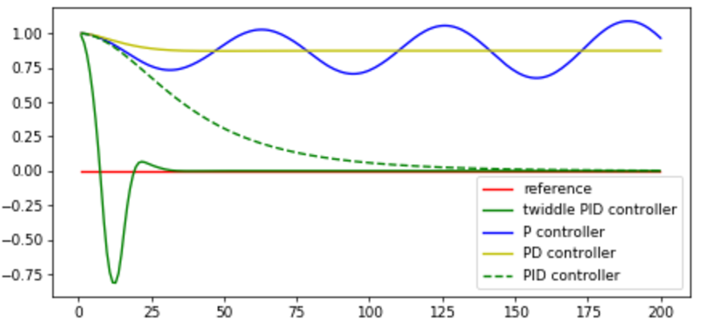
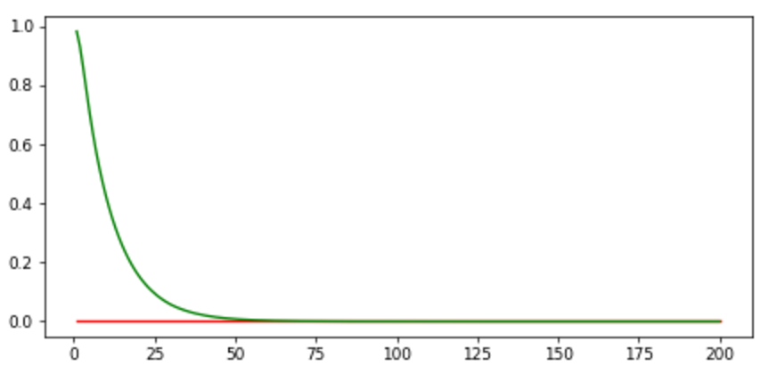

# CarND-PID-Parameter-Optimization
#### Twiddle (Coordinate Ascent)

Term 2 Lesson 16 of the Self-Driving Car Engineer Nanodegree program through Udacity presents a challenge to implement the Twiddle algorithm in Python with a 10° steering drift.

In the discussion forum, Andres Castano observed in 2012, that the Twiddle algorithm might be improved some orders of magnitude simply by adjusting the increase/decrease amount from 10% to 72.4%. I coupled this mechanism with an iterative restart procedure, to converge on a set of parameters that moves a robot/vehicle less dramatically toward the reference line while achieving an error below 1.0e-10.

For comparison, the diagram below illustrates a default parameter optimization using the standard Twiddle algorithm, if initialized with 𝜏p=0, 𝜏i=0, 𝜏d=0. Note how the solid green line overshoots the reference (red) line by more than 0.75 and then doubles back to eventually stabilize.

On the other hand, when initialized with the values 𝜏p=0.86933, 𝜏i=0.014547, 𝜏d=8.785924, then a different optimal solution approaches the reference (red) line more gradually with minimal overshoot. This result is found in 16 iterations using the modified Twiddle with a tolerance of 1e-07 and total error of 9.25e-11. It is not the lowest error possible, but the resulting trajectory is smoother and more logical.

